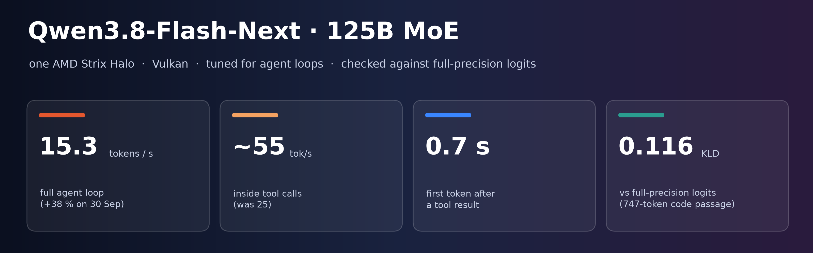
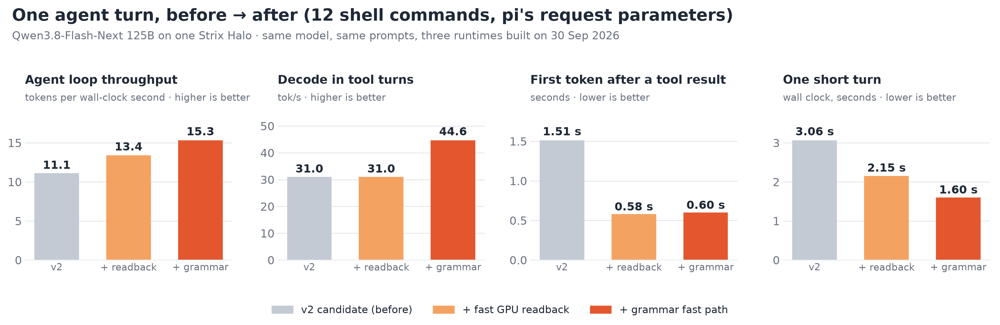
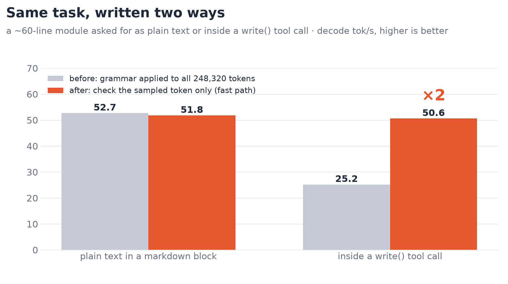
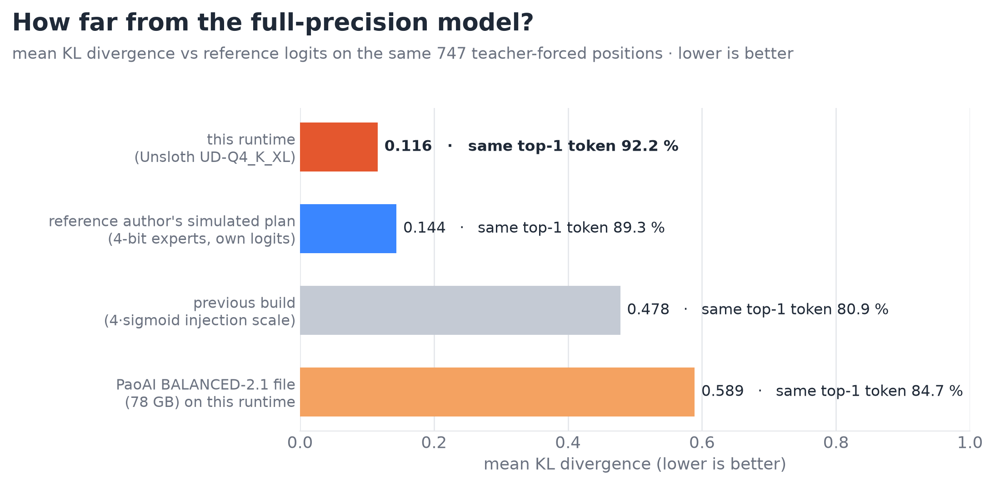

# strixhalo-verified



Large mixture-of-experts models on **one AMD Strix Halo box** (Ryzen AI Max+ 395, 128 GB unified memory) through
**Vulkan**, tuned for **local coding agents** and **checked against full-precision reference logits**. 🧪

First model: **Qwen3.8-Flash-Next** (125B MoE). Model card with every measurement and its method:
🤗 [Kevletesteur/Qwen3.8-Flash-Next-StrixHalo-Verified](https://huggingface.co/Kevletesteur/Qwen3.8-Flash-Next-StrixHalo-Verified).

| | |
|---|---|
| 🏎️ writing (decode), 8k / 32k | 43.0 / 40.1 tok/s (~41 at 64k on short answers) |
| 📖 reading (prefill), 8k / 32k / 64k | 656 / 585 / 483 tok/s |
| 🛠️ inside a tool call | ~55 tok/s (was 25) |
| ⏱️ first token after a short tool result | 0.7 s (was 1.5 s) |
| 🤖 agent loop, 12 shell commands | 15.3 tokens per wall-clock second (was 11.1) |
| 🎯 KL divergence vs full-precision reference | 0.116, same top-1 token 92.2 % (747-token code passage; 0.43 on a 4k passage) |

✅ Measured with `launch/qwen38-flash-next.sh` unchanged, on a from-scratch build of this repository (GPU clock on its
default setting): same greedy outputs, same KL divergence to the 6th digit and same agent-loop speed as our production
runtime. The 64k figures come from our production runs.



## 📦 What is here

| path | content |
|---|---|
| `runtime/patches/` | 54 patches on top of [LaurentZuijdwijk/llama.cpp](https://github.com/LaurentZuijdwijk/llama.cpp) `322e5cdf4cc` |
| `runtime/build.sh` | clone, apply, build (Vulkan) |
| `launch/qwen38-flash-next.sh` | the launcher, derived from our production launcher, every environment switch commented |
| `launch/mtp_head_gen_32k.bin` | the 32k-token vocabulary of the MTP draft head |
| `bench/` | agent-turn benchmark, tool-call speed probe |
| `CHANGELOG.md` | the main runtime changes of the last five weeks, with the measured effect where one was recorded, and known issues |

Weights are not redistributed: use Unsloth's
[UD-Q4_K_XL](https://huggingface.co/unsloth/Qwen3.8-Flash-Next-GGUF) (four shards; point `-m` at the first one) and
`mmproj-F16.gguf` from the same repository, and agentionai's
[MTP draft head](https://huggingface.co/agentionai/Qwen3.8-Flash-Next-MTP-ROCmFP4-FAST-GGUF)
(`Qwen3.8-Flash-Next-MTP-ROCmFP4-FAST.gguf`).

## 🚀 Quick start

```bash
hf download unsloth/Qwen3.8-Flash-Next-GGUF --include "UD-Q4_K_XL/*" --include "mmproj-F16.gguf" --local-dir ~/models/qwen38
hf download agentionai/Qwen3.8-Flash-Next-MTP-ROCmFP4-FAST-GGUF Qwen3.8-Flash-Next-MTP-ROCmFP4-FAST.gguf --local-dir ~/models/qwen38

git clone https://github.com/AIdevsmartdata/strixhalo-verified && cd strixhalo-verified
./runtime/build.sh      # needs git, cmake, a C++17 compiler, libvulkan-dev, glslc and spirv-headers
MODEL=~/models/qwen38/UD-Q4_K_XL/Qwen3.8-Flash-Next-UD-Q4_K_XL-00001-of-00004.gguf \
MMPROJ=~/models/qwen38/mmproj-F16.gguf \
MTP=~/models/qwen38/Qwen3.8-Flash-Next-MTP-ROCmFP4-FAST.gguf \
RUNTIME=$PWD/llama.cpp-strixhalo/build/bin \
./launch/qwen38-flash-next.sh
```

Host settings we run with: kernel boot options `amd_iommu=off amdgpu.gttsize=112640 ttm.pages_limit=28835840 amdgpu.lockup_timeout=30000`,
Ubuntu 26.04 (kernel 7.0, Mesa 26.0.8).

## 🔍 Check your setup

```bash
python3 bench/probe_tool_call_speed.py 8081 mine out/      # a module written as plain text, then inside a write() call
python3 bench/probe_agent_turns.py 8081 mine out/ 12 8000 fidele
```

On this runtime the tool-call probe gives about 50 tok/s for both arms; a runtime without the grammar fast path gives
about half inside the tool call:



## 🎯 Fidelity



Method, caveats and the bugs this caught are on the [model card](https://huggingface.co/Kevletesteur/Qwen3.8-Flash-Next-StrixHalo-Verified).

## 🙏 Credits

Qwen team (model) · Unsloth (quants) · llama.cpp and its Vulkan maintainers · LaurentZuijdwijk (Qwen3.8 Vulkan fork,
the base of this work) · Nathanw1014 (flash-attention prefill stack) · apepojken (QSA gather, radix top-k) ·
ciru-ai/ROCmFPX (FP4 types) · agentionai (MTP draft head) · nitinpanj (reference logits) · the authors of upstream PRs
#27941, #27991, #28023, #28040, #28068, #28123 and #28333 (open).

Built by [Kévin Rémondière](https://huggingface.co/Kevletesteur) with AI coding agents under his direction —
👋 **open to work** in LLM inference and applied AI (kevin.remondiere@gmail.com).

## 📜 License

MIT (the patches modify MIT-licensed llama.cpp code). The model weights are under the Qwen Community License.
